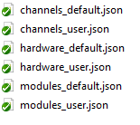
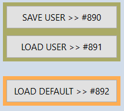
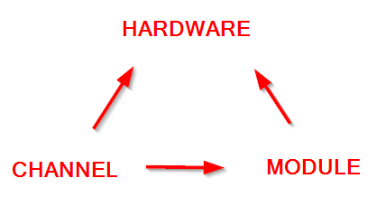

User Guide
##########

Usage (Windows)
***************

General Usage
=============

1. Start the ComVisu software: ``others/ComVisu/ComvisuV180Win64.exe``

  .. image:: _static/docu_images/ComVisu_Exe.png
      :alt: ComVisu_Exe

2. Switch to run tab and connect the interface

  .. image:: _static/docu_images/ComVisu_InterfaceConnect.png
      :alt: ComVisu_InterfaceConnect

3. Move to main sheet: ``Startseite``

  .. image:: _static/docu_images/ComVisu_MainSheet.png
      :alt: ComVisu_MainSheet

4. Run the batchfile to start the measurement system: ``others/ComVisu/START Measurement System.bat``

  .. image:: _static/docu_images/MeasurementSystem_StartBat.png
      :alt: MeasurementSystem_StartBat

5. Enter password for the Raspberry Pi and press enter

    .. image:: _static/docu_images/MeasurementSystem_Connected.png
        :alt: MeasurementSystem_Connected

6. Check the *keep-alive* indicator in the ComVisu GUI. If it is repeatedly flashing green, the connection is established.

    .. image:: _static/docu_images/ComVisu_KeepAlive.png
        :alt: ComVisu_KeepAlive

7. Ensure a USB drive is connected to the Raspberry Pi.

8. Start the measurement system by prinning ``Mess-System: START``

  .. image:: _static/docu_images/ComVisu_StartMeasurementSystem.png
      :alt: ComVisu_StartMeasurementSystem

9. Perform the tests on the measurement system

10. Once the tests are finished, press ``Mess-System: STOP``. Data will be saved on the USB drive.

  .. image:: _static/docu_images/ComVisu_StopMeasurementSystem.png
      :alt: ComVisu_StopMeasurementSystem

11. Stop the measuremen system by pressing ``CTRL+C`` in the terminal.

  .. image:: _static/docu_images/MeasurementSystem_Stop.png
      :alt: MeasurementSystem_Stop

Channel Configuration
=====================

Modify Channel Configuration
----------------------------

1. Repeat steps 1-6 from the General Usage section.

2. Move to main sheet: ``Konfiguration``

  .. image:: _static/docu_images/ComVisu_ConfigurationSheet.png
      :alt: ComVisu_ConfigurationSheet

3. Select the channel you want to configure

  .. image:: _static/docu_images/ComVisu_ChannelConfiguration.png
      :alt: ComVisu_ChannelConfiguration

4. Modify the channel settings (ON/OFF, model selection, or sample rate). After making a change, the channel will be deselected. Only one parameter can be adjusted at a time; reselect the channel to alter another parameter.

  .. image:: _static/docu_images/ComVisu_ChannelConfiguration.png
      :alt: ComVisu_ChannelConfiguration

Models
^^^^^^

The following models are available:

- ``LinearModel``: A model for a linear expression.
- ``NTCModel``: A model for a NTC thermistor.
- ``PTxModel``: A model for a PT100 or PT1000 or similar platinum resistance temperature sensor (PTx).
- ``KTYxModel``: A model for a KTY81-110 or similar silicon temperature sensor.
- ``StackedModel``: It allows stacking multiple models in a specific order, where the output of each model is passed as input to the next.

References
""""""""""

  .. autoclass:: MeasurementSystem.core.common.Models.LinearModel
    :members: __init__

  .. autoclass:: MeasurementSystem.core.common.Models.NTCModel
    :members:

  .. autoclass:: MeasurementSystem.core.common.Models.PTxModel
    :members:

  .. autoclass:: MeasurementSystem.core.common.Models.KTYxModel
    :members:

  .. autoclass:: MeasurementSystem.core.common.Models.StackedModel
    :members:

Sample Rate
^^^^^^^^^^^

Sample rate in *Hz* or *samples per second*.

A value of <= 0 will lead to full system speed. This is not recommended as it will lead also to a high CPU load and/or overflows and data loss.
Also a communication overflows can happen, which may lead to a system crash.

**Note:** The maximum value has to be evaluated, especially with a high number of channels enabled. Not done yet.

Configuration Files
===================

The configuration files are located in the ``src/MeasurementSystem/config`` directory.

**Important:** Changes in channel configurations will be applied immediately, but the file is not saved without manual intervention.

- Save/Load User: Save or load the current configuration to/from a file. Files saved as ``*_user.json``.
- Load Default: Load the pre-configured default configuration from a file. Files saved as ``*_default.json``.

Configuration files are stored in three diffrent levels: *hardware*, *channel* and *module*

- *hardware*: Contains the configuration for the hardware.
- *channel*: Contains the configuration for channels and its parent hardware.
- *module*: Contains the configuration for modules, its parent hardware and its channels.

Troubleshooting
***************

Software
========

On any issue, always check command line logs either in *ComVisu GUI* or in the *Terminal* where the batch file was started.

Measurement System Lockfile
---------------------------

The measurement system uses a lockfile to prevent double execution.
This could happen if the system is started twice or the system is not stopped correctly.

The lockfile is located in ``/tmp/MeasurementSystem.lock``.

When the lockfile is present and the system is started, the active process will be killed and the lockfile will be removed.
The system is then ready for a new attempt. This also happens on reboot.
